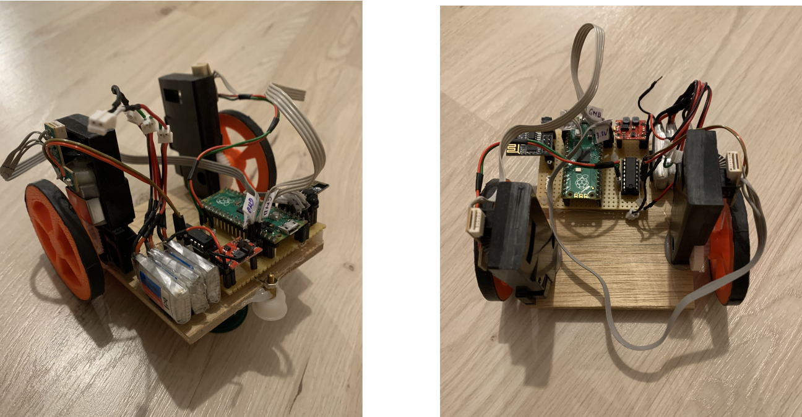
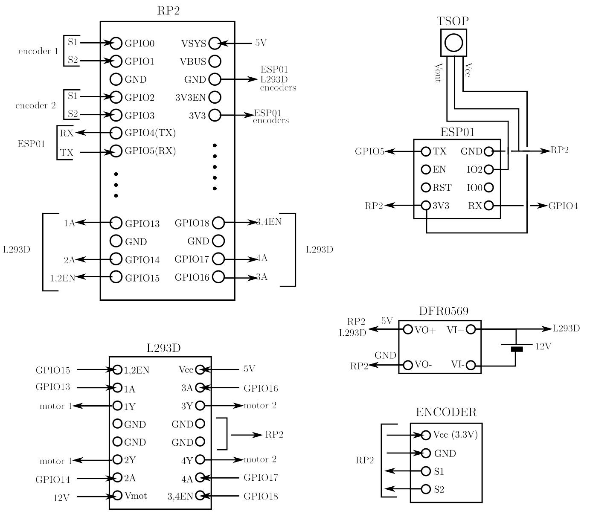
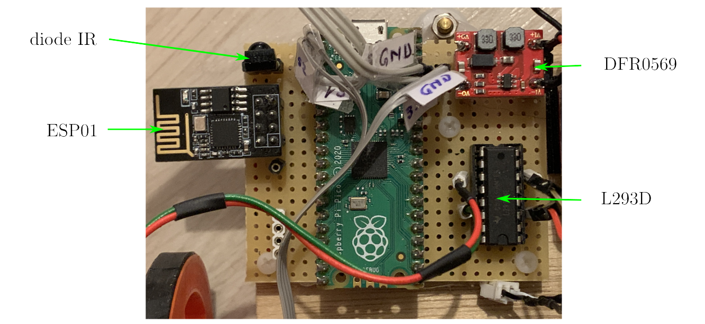
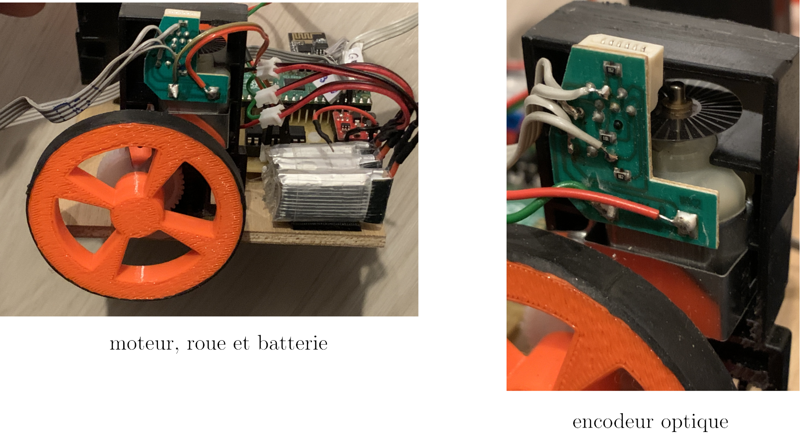
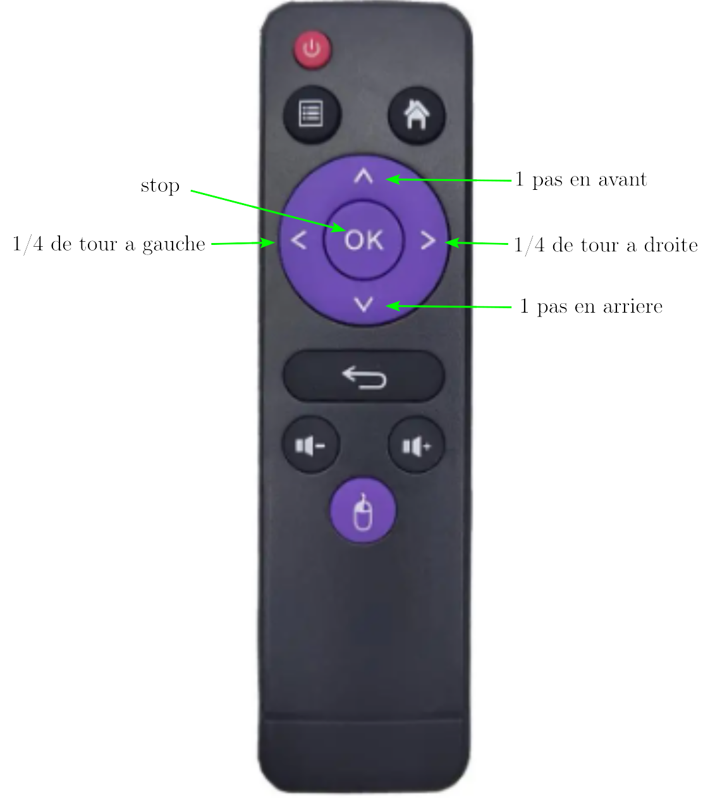

  

## Introduction

Ce premier prototype est basé sur un Raspberry Pico (_RP2_) programmé sous micropython.

Il utilise deux moteurs à courant continu munis chacun d'un encodeur optique et alimentés par un double pont en H (_L293D_). Le pilotage est fait par télécommande infra-rouge. Pour simplifier, la réception et la transmission des commandes au RP2 utilise une diode infra-rouge et un _ESP01_ programmé pour cette tâche.

L'alimentation des moteurs se fait en 12V (3 accus Li-ion). Un convertisseur buck-boost fournit les 5V nécessaires au RP2.

## Schéma electrique

  

## Liste de materiel:
- __Raspberry Pico__ : https://www.gotronic.fr/art-carte-raspberry-pi-pico-33027.htm
- __double pont en H L293D__ : https://www.gotronic.fr/art-l293d-14072.htm
- __diode IR TL1838__ (ou équivalent): https://fr.aliexpress.com/item/4000610270256.html?spm=a2g0o.order_list.order_list_main.114.5f2c5e5bFkj0JY&gatewayAdapt=glo2fra
- __régulateur buck-boost DFR0569__ (ou équivalent): https://www.gotronic.fr/art-regulateur-5-vcc-dfr0569-29560.htm
- __ESP01__ : https://fr.aliexpress.com/item/1005004626018608.html?spm=a2g0o.productlist.main.5.202a387dOWbNPY&algo_pvid=d97af2e1-680c-470d-a23e-a5389708092f&aem_p4p_detail=20240105083824621622498933800001715866&algo_exp_id=d97af2e1-680c-470d-a23e-a5389708092f-2&pdp_npi=4%40dis%21EUR%216.00%216.0%21%21%216.42%21%21%40211b81a317044727042931116e5c51%2112000029882404227%21sea%21FR%212002504188%21&curPageLogUid=mbNFmuIELFBq&utparam-url=scene%3Asearch%7Cquery_from%3A&search_p4p_id=20240105083824621622498933800001715866_3
- __telecommande IR__ : https://fr.aliexpress.com/item/1005005880586343.html?spm=a2g0o.order_list.order_list_main.5.50145e5bUaWUCF&gatewayAdapt=glo2fra
- __3 accus Li-ion__
- __2 moteurs à courant continu avec encodeurs__
- __roue libre__ : https://www.gotronic.fr/art-roue-libre-1-2-952-37787.htm

## Réalisation

  

Les moteurs de ce prototype sont des moteurs récupérés sur l'entrainement scanner d'une imprimante jet d'encre. Ils ont l'avantage d'être munis d'encodeurs à signaux en quadrature permettant de déterminer la position, la vitesse et le sens de rotation de chacune des roues. 

  

Les roues, de diamètre 60mm, ont été fabriquées en impression 3D. Compte-tenu de la réduction (engrenages plastiques), chaque encodeur fournit 1450 pulses par tour, ce qui donne une précision très satisfaisante sur la position (et la vitesse).

## Installation

Avec l'IDE Arduino, téléverser le fichier _IRrecvDemo.ino_ dans l'_ESP01_. Ce dernier est alors programmé pour recevoir en continu les signaux de la télécommande et les transmettre au _RP2_ sur la liaison série UART1. La vitesse de transmission est fixée à 9600 bauds, mais elle peut être augmentée à 115200 bauds sans difficulté. Par défaut, le codage IR utilisé est celui de la télécommande ci-dessus ("chinoise"). Il est possible d'utiliser un autre modèle à condition de remplacer le fichier _codes_chi.py_ par un fichier contenant les nouveaux codes. Ci-dessus, _codes_pan.py_ = Panasonic, _codes_phi.py_ = Philips, _codes_sam.py_ = samsung.

Charger ensuite l'interpreteur micropython sur la carte RP2, puis copier les fichiers .py ci-dessus dans le répertoire principal. A la mise sous tension le robot est prêt à fonctionner.

## Fonctionnement

  

## Code

- __dcMotor.py__ : driver de moteur à courant continu.
- __PioEncoder.py__ : driver d'encodeur optique. Il est basé sur les machines d'état (Pio) du RP2.
- __codes_chi.py__ : codes infra-rouges de la télécommande (avec la fonction de lecture _decode_ir_).
- __proto_ludomat_1.py__ : script principal
  
  la fonction _go_position_ qui permet d'atteindre la position cible contient un correcteur PD (proportionnelle-dérivée) pour chacun des moteurs. L'arrêt du moteur se fait à l'interieur d'un intervalle centré sur la position cible (_tgt_count_) de largeur _dead_zone_=3. L'erreur de position linéaire est donc au maximum de : 3/1450 x pi x 60 = 0,4 mm pour chacune des roues.
