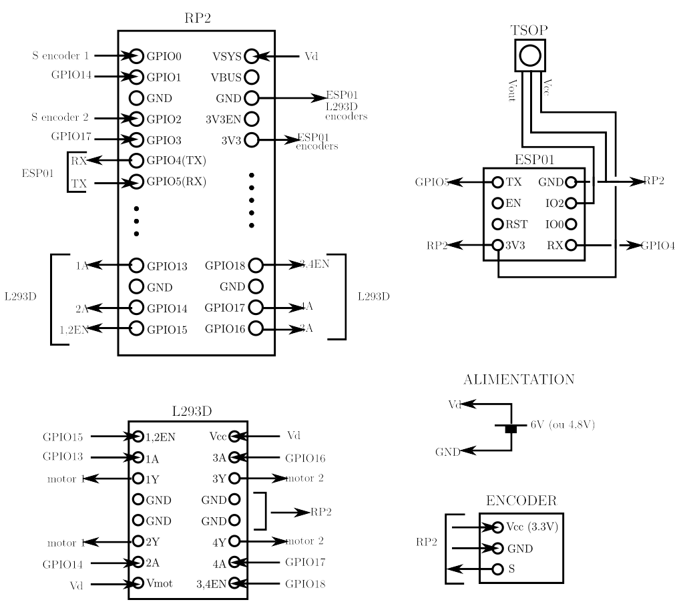

.

## Introduction

Le deuxième prototype possède la même structure que Proto 1 : Raspberry Pico (RP2) programmé en micropython, deux moteurs à courant continu pilotés par un double pont en H (L293D), transmission des commandes infra-rouges au RP2 par un ESP01.

Plusieurs différences cependant : le chassis, les moteurs et les roues proviennent d'un kit Aliexpress, les encodeurs optiques des moteurs sont des encodeurs à une seule voie (pas de détection du sens de rotation) et à très faible résolution (20 pulses par tour de roue, il est donc compliqué d'obtenir des déplacements précis), et l'alimentation est assurée par 4 piles AA de 1,5V (ou 4 accus NiMh de 1,2V). Ce dernier choix permet d'alimenter directement le RP2 sans passer par un régulateur de tension.

## Schéma electrique

.

## Réalisation

.

