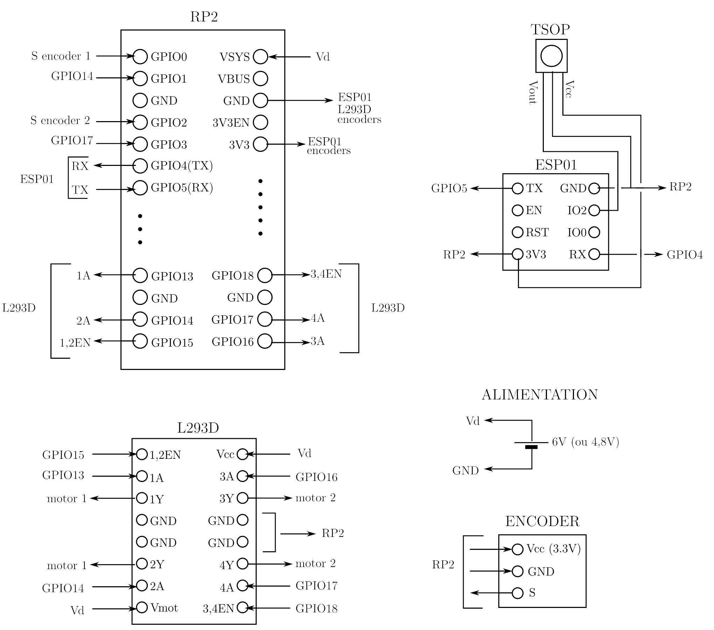

  

## Introduction

Le deuxième prototype possède la même structure que Proto 1 : Raspberry Pico (RP2) programmé en micropython, deux moteurs à courant continu pilotés par un double pont en H (L293D), transmission des commandes infra-rouges au RP2 par un ESP01.

Plusieurs différences cependant : le chassis, les moteurs et les roues proviennent d'un kit Aliexpress, les encodeurs optiques des moteurs sont des encodeurs à une seule voie (pas de détection du sens de rotation) et à très faible résolution (20 pulses par tour de roue, il est donc compliqué d'obtenir des déplacements précis), et l'alimentation est assurée par 4 piles AA de 1,5V (ou 4 accus NiMh de 1,2V). Ce dernier choix permet d'alimenter directement le RP2 sans passer par un régulateur de tension.

## Schéma electrique

  

## Liste de materiel:
- __Raspberry Pico__ : https://www.gotronic.fr/art-carte-raspberry-pi-pico-33027.htm
- __double pont en H L293D__ : https://www.gotronic.fr/art-l293d-14072.htm
- __diode IR TL1838__ (ou équivalent): https://fr.aliexpress.com/item/4000610270256.html?spm=a2g0o.order_list.order_list_main.114.5f2c5e5bFkj0JY&gatewayAdapt=glo2fra
- __ESP01__ : https://fr.aliexpress.com/item/1005004626018608.html?spm=a2g0o.productlist.main.5.202a387dOWbNPY&algo_pvid=d97af2e1-680c-470d-a23e-a5389708092f&aem_p4p_detail=20240105083824621622498933800001715866&algo_exp_id=d97af2e1-680c-470d-a23e-a5389708092f-2&pdp_npi=4%40dis%21EUR%216.00%216.0%21%21%216.42%21%21%40211b81a317044727042931116e5c51%2112000029882404227%21sea%21FR%212002504188%21&curPageLogUid=mbNFmuIELFBq&utparam-url=scene%3Asearch%7Cquery_from%3A&search_p4p_id=20240105083824621622498933800001715866_3
- __telecommande IR__ : https://fr.aliexpress.com/item/1005005880586343.html?spm=a2g0o.order_list.order_list_main.5.50145e5bUaWUCF&gatewayAdapt=glo2fra
- __kit robot 2 roues__ : https://fr.aliexpress.com/item/1005006101550871.html?spm=a2g0o.order_list.order_list_main.168.46aa5e5bvzKPRG&gatewayAdapt=glo2fra
- __4 piles AA ou 4 accus NiMh__

## Réalisation

  

Pour simplifier et compte tenu de la taille du chassis, les connections sont réalisées sur deux breadboards.

Le diamètre des roues est de 65mm.

Pour Palier l'absence de deuxième voie sur les encodeurs, les broches 1 et 3 du RP2 sont connectées (resp.) aux broches 14 et 17 (dont l'état donne le sens de la commande des moteurs, et non le sens réel).

  

## Installation

Identique à celle de Proto 1 :

- Avec l'IDE Arduino, téléverser le fichier _IRrecvDemo.ino_ dans l'_ESP01_. Ce dernier est alors programmé pour recevoir en continu les signaux de la télécommande et les transmettre au _RP2_ sur la liaison série UART1. La vitesse de transmission est fixée à 9600 bauds, mais elle peut être augmentée à 115200 bauds sans difficulté. Par défaut, le codage IR utilisé est celui de la télécommande ci-dessus ("chinoise"). Il est possible d'utiliser un autre modèle à condition de remplacer le fichier _codes_chi.py_ par un fichier contenant les nouveaux codes. Ci-dessus, _codes_pan.py_ = Panasonic, _codes_phi.py_ = Philips, _codes_sam.py_ = samsung.
- Charger ensuite l'interpreteur micropython sur la carte RP2, puis copier les fichiers .py ci-dessus dans le répertoire principal. A la mise sous tension le robot est prêt à fonctionner.

## Fonctionnement

  

## Code

- __dcMotor.py__ : driver de moteur à courant continu.
- __PioEncoder.py__ : driver d'encodeur optique. Il est basé sur les machines d'état (Pio) du RP2.
- __codes_chi.py__ : codes infra-rouges de la télécommande (avec la fonction de lecture _decode_ir_).
- __proto_ludomat_2.py__ : script principal
  
  La fonction _go_position_ qui permet d'atteindre la position cible contient un correcteur proportionnel pour chacun des moteurs (au contraire de Proto 1, la correction PD n'est pas nécessaire ici). L'arrêt du moteur se fait à l'interieur d'un intervalle centré sur la position cible (_tgt_count_) de largeur _dead_zone_=1. L'erreur de position linéaire est donc au maximum de : 1/20 x pi x 65 = 10 mm pour chacune des roues, ce qui est assez médiocre. Pour une améloriation de la précision, voir le code d'Arnaud.
