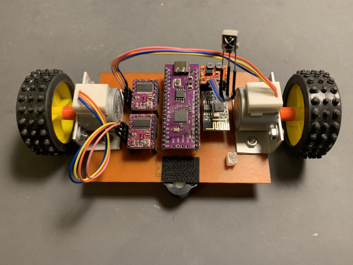
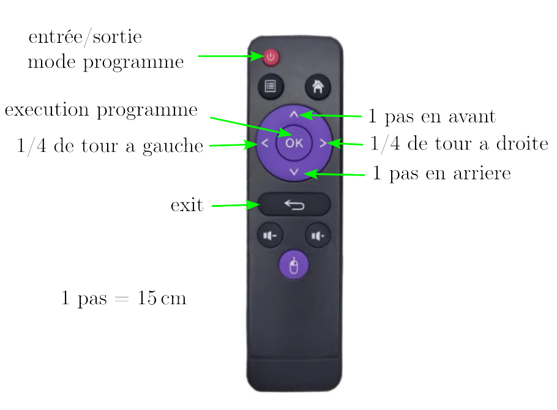

  

  
## Introduction

Ce troisième prototype utilise, comme les deux premiers, un Raspberry Pico (RP2) programmé en micropython, mais les moteurs à courant continu sont remplacés par deux moteurs pas-a-pas qui présentent l'avantage d'une grande précision de positionnement angulaire et d'une commande simple (commande en boucle ouverte, pas de correcteur type PID).

L'alimentation est confiée à une batterie de 3 accus Li-ion en série : Vd=12V (11,1V nominal, 12,6V pleine charge).

## Schéma electrique

## Liste de materiel:
- __Raspberry Pico (clone)__ : https://fr.aliexpress.com/item/1005005630743750.html?spm=a2g0o.order_list.order_list_main.258.46aa5e5bvzKPRG&gatewayAdapt=glo2fra
- __driver moteur pas-a-pas DRV8825__ : https://fr.aliexpress.com/item/1005005264044268.html?spm=a2g0o.productlist.main.39.74645415FNToWl&algo_pvid=edcce629-0c1f-4e49-824d-ca9f92afeeb6&aem_p4p_detail=20240106105356987473188972600003007181&algo_exp_id=edcce629-0c1f-4e49-824d-ca9f92afeeb6-19&pdp_npi=4%40dis%21EUR%211.14%211.14%21%21%211.22%21%21%40211b600217045672368034440e19e4%2112000032420457428%21sea%21FR%212002504188%21&curPageLogUid=Ev1yMldwy3Ip&search_p4p_id=20240106105356987473188972600003007181_20
- __diode IR TL1838__ (ou équivalent): https://fr.aliexpress.com/item/4000610270256.html?spm=a2g0o.order_list.order_list_main.114.5f2c5e5bFkj0JY&gatewayAdapt=glo2fra
- __régulateur buck-boost DFR0569__ (ou équivalent): https://www.gotronic.fr/art-regulateur-5-vcc-dfr0569-29560.htm
- __ESP01__ : https://fr.aliexpress.com/item/1005004626018608.html?spm=a2g0o.productlist.main.5.202a387dOWbNPY&algo_pvid=d97af2e1-680c-470d-a23e-a5389708092f&aem_p4p_detail=20240105083824621622498933800001715866&algo_exp_id=d97af2e1-680c-470d-a23e-a5389708092f-2&pdp_npi=4%40dis%21EUR%216.00%216.0%21%21%216.42%21%21%40211b81a317044727042931116e5c51%2112000029882404227%21sea%21FR%212002504188%21&curPageLogUid=mbNFmuIELFBq&utparam-url=scene%3Asearch%7Cquery_from%3A&search_p4p_id=20240105083824621622498933800001715866_3
- __telecommande IR__ : https://fr.aliexpress.com/item/1005005880586343.html?spm=a2g0o.order_list.order_list_main.5.50145e5bUaWUCF&gatewayAdapt=glo2fra
- __3 accus Li-ion__ : https://fr.aliexpress.com/item/1005004551448757.html?spm=a2g0o.order_list.order_list_main.29.5dfe5e5bNK2Vdy&gatewayAdapt=glo2fra
- __2 moteurs pas-a-pas bipolaires__ : https://www.gotronic.fr/art-moteur-24byj48-19028.htm
- __roue libre__ : https://www.gotronic.fr/art-roue-libre-1-2-952-37787.htm

Les 24BYJ48 sont des moteurs 5V - 300mA. Le nombre de pas par tour d'arbre en sortie est 1055 (mesuré).

Le driver DRV8825 nécessite une tension d'alimentation moteur supérieure à 8V d'où le choix de la batterie Li-ion, mais l'intensité maximale est réglable à l'aide d'un potentiomètre ce qui permet son utilisation avec le 24BYJ48. Le passage de la broche EN (enable) à l'état haut permet de couper l'intensité dans les enroulements du moteur lorsque celui-ci est immobile, et évite l'échauffement. La contrepartie est l'absence de couple de maintien au repos (inutile ici). 

## Réalisation

Les composants sont implantés sur un circuit imprimé 100mmx70mm qui sert également de chassis. Les moteurs sont fixés au chassis à l'aide de 2 morceaux de cornière aluminium de 20mmx20mm. 

  

  
La fixation des roues (diamètre 47mm) sur les arbres de sortie moteur a nécessité la fabrication d'un adaptateur (impression 3D).

  

  
Les trois accus sont fixés sur le chassis à l'aide de velcro autocollant afin de les rendre amovibles.

Avant la mise sous tension, il faut régler la limite en courant de sortie des DRV8825 (300mA) : https://www.pololu.com/product/2133

## Installation

Avec l'IDE Arduino, téléverser le fichier _IRrecvDemo.ino_ dans l'_ESP01_. Ce dernier est alors programmé pour recevoir en continu les signaux de la télécommande et les transmettre au _RP2_ sur la liaison série UART1. La vitesse de transmission est fixée à 9600 bauds, mais elle peut être augmentée à 115200 bauds sans difficulté. Par défaut, le codage IR utilisé est celui de la télécommande ci-dessus ("chinoise"). Il est possible d'utiliser un autre modèle à condition de remplacer le fichier _codes_chi.py_ par un fichier contenant les nouveaux codes. Ci-dessus, _codes_pan.py_ = Panasonic, _codes_phi.py_ = Philips, _codes_sam.py_ = samsung.

Charger ensuite l'interpreteur micropython sur la carte RP2, puis copier les fichiers .py ci-dessus dans le répertoire principal. A la mise sous tension le robot est prêt à fonctionner.

## Fonctionnement

  

Le robot possède deux modes de fonctionnement : 'RUN' et 'PROGRAMME'. La touche ON/OFF permet de switcher d'un mode à l'autre. En mode 'PROGRAMME', la led verte du RP2 est allumée.

Au démarrage, le robot est en mode 'RUN' : le mouvement est exécuté 1 seconde après pression sur la touche de commande.

En mode 'PROGRAMME':

- les mouvements sont ajoutés séquentiellement dans le programme à chaque pression de touche, mais non executés,
- la touche OK provoque l'exécution du programme enregistré à partir du début. Les mouvements sont espacés de 1 seconde,
- la touche ON/OFF provoque la remise à zéro du programme et le passage en mode 'RUN'.

La touche RETURN termine l'execution du script. Il faut rebooter le RP2 pour le relancer.

## Code

- __pwmStepper.py__ : driver de moteur pas-à-pas.
- __codes_chi.py__ : codes infra-rouges de la télécommande (avec la fonction de lecture _decode_ir_).
- __proto_ludomat_3.py__ : script principal
  
  Le déplacement linéaire pour un pas de moteur est : 1/1055 x pi x 47 = 0,14 mm ce qui permet d'atteindre aisément d'effectuer des mouvements  de grande précision (pas de 15cm, rotation de 90°).

