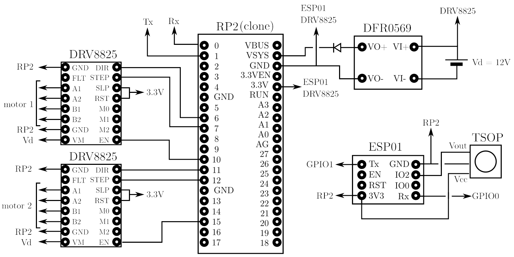
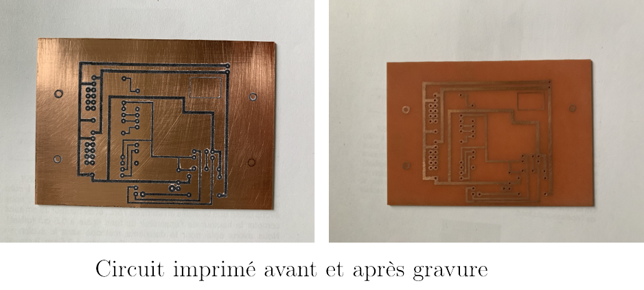
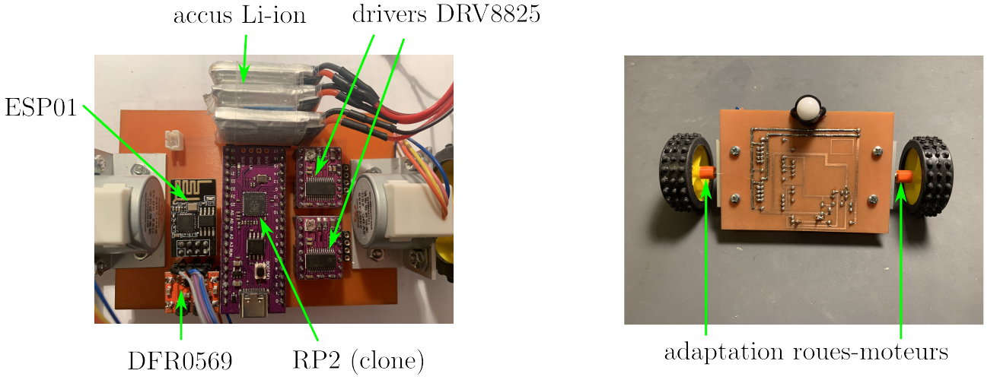

## Introduction

Ce troisième prototype utilise, comme les deux premiers, un Raspberry Pico (RP2) programmé en micropython, mais les moteurs à courant continu sont remplacés par deux moteurs pas-a-pas qui présentent l'avantage d'une grande précision de positionnement angulaire et d'une commande simple (commande en boucle ouverte, pas de correcteur type PID).

L'alimentation est confiée à une batterie de 3 accus Li-ion en série : Vd=12V (11,1V nominal, 12,6V pleine charge).

## Schéma electrique

## Liste de materiel:
- __Raspberry Pico (clone)__ : https://fr.aliexpress.com/item/1005005630743750.html?spm=a2g0o.order_list.order_list_main.258.46aa5e5bvzKPRG&gatewayAdapt=glo2fra
- __driver moteur pas-a-pas DRV8825__ : https://fr.aliexpress.com/item/1005005264044268.html?spm=a2g0o.productlist.main.39.74645415FNToWl&algo_pvid=edcce629-0c1f-4e49-824d-ca9f92afeeb6&aem_p4p_detail=20240106105356987473188972600003007181&algo_exp_id=edcce629-0c1f-4e49-824d-ca9f92afeeb6-19&pdp_npi=4%40dis%21EUR%211.14%211.14%21%21%211.22%21%21%40211b600217045672368034440e19e4%2112000032420457428%21sea%21FR%212002504188%21&curPageLogUid=Ev1yMldwy3Ip&search_p4p_id=20240106105356987473188972600003007181_20
- __diode IR TL1838__ (ou équivalent): https://fr.aliexpress.com/item/4000610270256.html?spm=a2g0o.order_list.order_list_main.114.5f2c5e5bFkj0JY&gatewayAdapt=glo2fra
- __régulateur buck-boost DFR0569__ (ou équivalent): https://www.gotronic.fr/art-regulateur-5-vcc-dfr0569-29560.htm
- __ESP01__ : https://fr.aliexpress.com/item/1005004626018608.html?spm=a2g0o.productlist.main.5.202a387dOWbNPY&algo_pvid=d97af2e1-680c-470d-a23e-a5389708092f&aem_p4p_detail=20240105083824621622498933800001715866&algo_exp_id=d97af2e1-680c-470d-a23e-a5389708092f-2&pdp_npi=4%40dis%21EUR%216.00%216.0%21%21%216.42%21%21%40211b81a317044727042931116e5c51%2112000029882404227%21sea%21FR%212002504188%21&curPageLogUid=mbNFmuIELFBq&utparam-url=scene%3Asearch%7Cquery_from%3A&search_p4p_id=20240105083824621622498933800001715866_3
- __telecommande IR__ : https://fr.aliexpress.com/item/1005005880586343.html?spm=a2g0o.order_list.order_list_main.5.50145e5bUaWUCF&gatewayAdapt=glo2fra
- __3 accus Li-ion__ : https://fr.aliexpress.com/item/1005004551448757.html?spm=a2g0o.order_list.order_list_main.29.5dfe5e5bNK2Vdy&gatewayAdapt=glo2fra
- __2 moteurs pas-a-pas bipolaires__ : https://www.gotronic.fr/art-moteur-24byj48-19028.htm
- __roue libre__ : https://www.gotronic.fr/art-roue-libre-1-2-952-37787.htm

## Réalisation

Les compoasnts sont implantés sur un circuit imprimé 100mmx70mm qui sert également de chassis. Les moteurs sont vissés au chassis à l'aide de 2 morceaux de cornière aluminium de 20mmx20mm. 

  

  
La fixation des roues (diamètre 47mm) sur les arbres de sortie moteur a nécessité la fabrication d'un adaptateur (impression 3D).

  

  
Les trois accus sont fixés sur la chassis à l'aide de velcro autocollant afin de les rendre amovibles.

