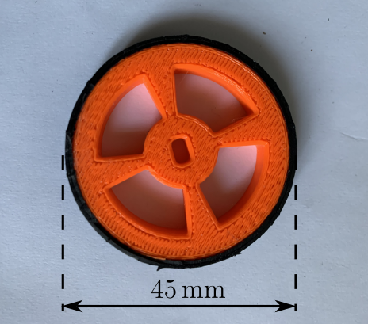
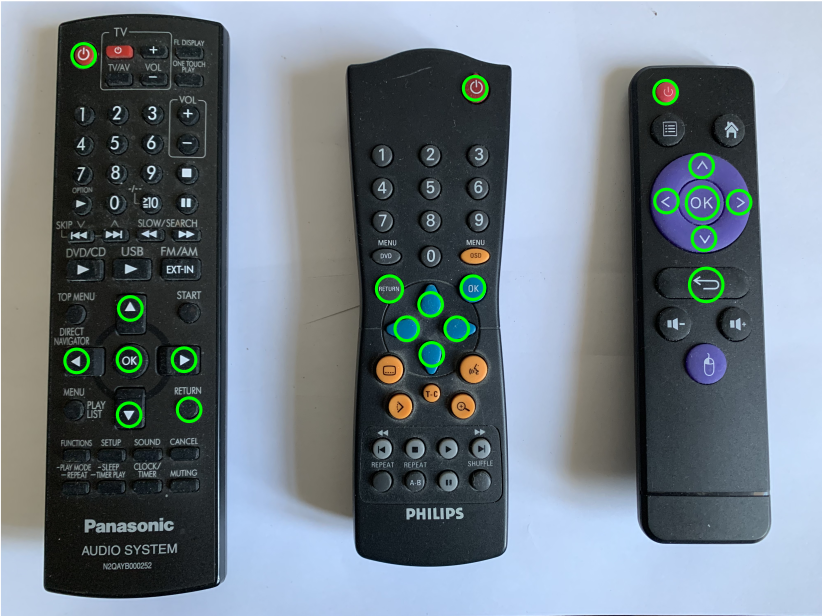

  

  
## Introduction

Quatrieme prototype, très proche de Proto 3. Mêmes moteurs et mêmes drivers. Le microcontrolleur est un RP2040 Zero, clone chinois du Raspberry Pico à 23 broches seulement (20 GPIOs). Deux LEDs blanches ont été ajoutées à l'avant pour indiquer le sens de déplacement. La diode neopixel du RP2040 Zero est utilisée pour indiquer le mode de fonctionnement. Un algorithme de détection de la télécommande a été ajouté.

## Schéma electrique

## Liste de materiel:
- __RP2040 Zero__ : https://fr.aliexpress.com/item/1005005106663725.html?spm=a2g0o.order_list.order_list_main.30.7f2b5e5b4IaUvN&gatewayAdapt=glo2fra
- __driver moteur pas-a-pas DRV8825__ : https://fr.aliexpress.com/item/1005005264044268.html?spm=a2g0o.productlist.main.39.74645415FNToWl&algo_pvid=edcce629-0c1f-4e49-824d-ca9f92afeeb6&aem_p4p_detail=20240106105356987473188972600003007181&algo_exp_id=edcce629-0c1f-4e49-824d-ca9f92afeeb6-19&pdp_npi=4%40dis%21EUR%211.14%211.14%21%21%211.22%21%21%40211b600217045672368034440e19e4%2112000032420457428%21sea%21FR%212002504188%21&curPageLogUid=Ev1yMldwy3Ip&search_p4p_id=20240106105356987473188972600003007181_20
- __diode IR TL1838__ (ou équivalent): https://fr.aliexpress.com/item/4000610270256.html?spm=a2g0o.order_list.order_list_main.114.5f2c5e5bFkj0JY&gatewayAdapt=glo2fra
- __régulateur buck-boost DFR0569__ (ou équivalent): https://www.gotronic.fr/art-regulateur-5-vcc-dfr0569-29560.htm
- __ESP01__ : https://fr.aliexpress.com/item/1005004626018608.html?spm=a2g0o.productlist.main.5.202a387dOWbNPY&algo_pvid=d97af2e1-680c-470d-a23e-a5389708092f&aem_p4p_detail=20240105083824621622498933800001715866&algo_exp_id=d97af2e1-680c-470d-a23e-a5389708092f-2&pdp_npi=4%40dis%21EUR%216.00%216.0%21%21%216.42%21%21%40211b81a317044727042931116e5c51%2112000029882404227%21sea%21FR%212002504188%21&curPageLogUid=mbNFmuIELFBq&utparam-url=scene%3Asearch%7Cquery_from%3A&search_p4p_id=20240105083824621622498933800001715866_3
- __telecommande IR__ : https://fr.aliexpress.com/item/1005005880586343.html?spm=a2g0o.order_list.order_list_main.5.50145e5bUaWUCF&gatewayAdapt=glo2fra
- __3 accus Li-ion__ : https://fr.aliexpress.com/item/1005004551448757.html?spm=a2g0o.order_list.order_list_main.29.5dfe5e5bNK2Vdy&gatewayAdapt=glo2fra
- __2 moteurs pas-a-pas bipolaires__ : https://www.gotronic.fr/art-moteur-24byj48-19028.htm
- __roue libre__ : [https://www.gotronic.fr/art-roue-libre-1-2-952-37787.htm](https://fr.aliexpress.com/item/1005005888599065.html?spm=a2g0o.order_list.order_list_main.36.7f2b5e5b4IaUvN&gatewayAdapt=glo2fra)https://fr.aliexpress.com/item/1005005888599065.html?spm=a2g0o.order_list.order_list_main.36.7f2b5e5b4IaUvN&gatewayAdapt=glo2fra
- __interrupteur miniature__ : https://fr.aliexpress.com/item/1005006245665830.html?spm=a2g0o.order_list.order_list_main.24.7f2b5e5b4IaUvN&gatewayAdapt=glo2fra

## Réalisation

Les composants sont implantés sur un circuit imprimé 100mmx100mm qui sert également de chassis (fichier _typon_proto_4.svg_). Les moteurs sont fixés au chassis à l'aide de 2 morceaux de cornière aluminium de 20mmx20mm. 

  

  
Les roues sont fabriquées en impression 3D (fichier _roues.stl_). Les pneus sont faits en chambre à air de vélo (2 couches).

  

  
L'accu est fixé sur le chassis à l'aide de velcro autocollant afin de le rendre amovible.

Avant la mise sous tension, il faut régler la limite en courant de sortie des DRV8825 (300mA) : https://www.pololu.com/product/2133

## Fonctionnement

Après le boot, le robot attend l'association avec une télécommande : la diode neopixel est allumée en rouge. Pour l'associer, il suffit d'envoyer un code IR à partir d'une des télécommandes connues: Panasonic, Philips ou chinoise. La diode neopixel passe au vert et le robot est prêt à fonctionner.

  

__Attention__ : seules, les touches entourées en vert sur la photo sont reconnues : ON/OFF, GAUCHE, DROITE, HAUT, BAS, OK et RETURN.

Le robot possède deux modes de fonctionnement : 'RUN' et 'PROGRAMME'. La touche ON/OFF permet de switcher d'un mode à l'autre. En mode 'RUN', la diode neopixel est allumée en vert, en mode 'PROGRAMME', elle est allumée en bleu.

Au démarrage, le robot est en mode 'RUN' : le mouvement est exécuté 1 seconde après pression sur la touche de commande.

En mode 'PROGRAMME':

- les mouvements sont ajoutés séquentiellement dans le programme à chaque pression de touche, mais non executés,
- la touche OK provoque l'exécution du programme enregistré à partir du début. Les mouvements sont espacés de 1 seconde,
- la touche ON/OFF provoque la remise à zéro du programme et le passage en mode 'RUN'.

La touche RETURN termine l'execution du script. Il faut rebooter le RP2 (OFF/ON sur l'interrupteur) pour le relancer.
